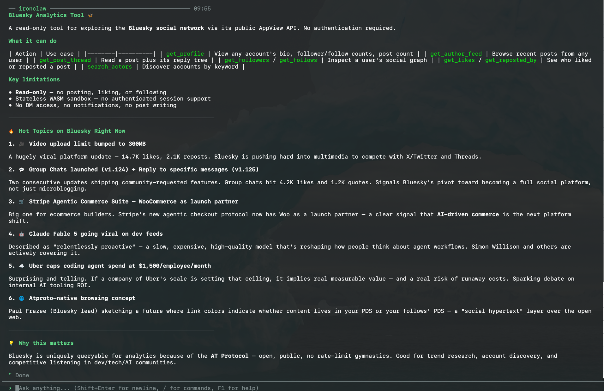

# Bluesky Analytics Tool

A sandboxed WASM tool that lets an IronClaw agent browse Bluesky for analytics —
profiles, feeds, engagement, and the social graph — over the AT Protocol.

No authentication is required. Every action is a public XRPC `GET` against the
unauthenticated AppView `public.api.bsky.app`, and network access is restricted to
that host as declared in `bluesky-analytics-tool.capabilities.json`.

> **Read-only.** Posting, replying/commenting, liking, reposting, and following are
> **not** supported. Those are writes that require an authenticated session
> (`com.atproto.server.createSession`), whose login takes the app password in the
> request body. A stateless WASM tool cannot read a secret nor have the host inject
> one into a body, so writes are impossible in this lane — they belong on the
> stateful IronClaw Reborn Script lane (a future phase).



## Actions

The tool exposes a single parameter, `action`, plus a few optional fields.

| Action | Required | Optional | Description |
|--------|----------|----------|-------------|
| `get_profile` | `actor` | — | Profile for one account: handle, DID, bio, follower/follows/post counts. |
| `get_author_feed` | `actor` | `limit`, `cursor`, `filter` | An account's posts, each with like/repost/reply/quote counts. `filter` = `posts_with_replies` / `posts_no_replies` / `posts_with_media` / `posts_and_author_threads`. |
| `get_post_thread` | `uri` | `depth` | A post and its nested replies (the comment tree). `depth` default 6, max 100. |
| `get_followers` | `actor` | `limit`, `cursor` | Accounts that follow the given account. |
| `get_follows` | `actor` | `limit`, `cursor` | Accounts the given account follows. |
| `get_likes` | `uri` | `limit`, `cursor` | Accounts that liked a post. |
| `get_reposted_by` | `uri` | `limit`, `cursor` | Accounts that reposted a post. |
| `search_actors` | `q` | `limit`, `cursor` | Find accounts by keyword (matches handle/display name/bio). |

### Identifiers

- **`actor`** — a handle (`alice.bsky.social`) or a DID (`did:plc:...`).
- **`uri`** — a post at-uri: `at://did:plc:.../app.bsky.feed.post/<rkey>`. Get one from
  `get_author_feed` output (each item carries its `uri`).
- **`limit`** — 1–100, default 50 (clamped). **`cursor`** — opaque string from a prior
  response; pass it back for the next page.

## Output

Responses are projected to a compact, analytics-shaped JSON — only identifiers, text,
timestamps, at-uris, and engagement counts — instead of the verbose raw XRPC payload.
List actions echo the next-page `cursor` (omitted at end of list).

Example — `get_author_feed` item:

```json
{
  "uri": "at://did:plc:.../app.bsky.feed.post/3mojb23vtt22c",
  "cid": "bafy...",
  "text": "v1.125 is live!",
  "createdAt": "2026-06-17T21:01:15.786Z",
  "langs": ["en"],
  "likeCount": 2547, "repostCount": 346, "replyCount": 193, "quoteCount": 114,
  "author": { "handle": "bsky.app", "did": "did:plc:z72i7hdynmk6r22z27h6tvur", "displayName": "Bluesky", "description": "..." },
  "indexedAt": "2026-06-17T21:01:16.001Z",
  "isRepost": false,
  "isReply": false
}
```

## Example invocations

```jsonc
{ "action": "get_profile", "actor": "bsky.app" }

{ "action": "get_author_feed", "actor": "bsky.app", "limit": 25, "filter": "posts_no_replies" }

{ "action": "get_post_thread", "uri": "at://did:plc:z72i7hdynmk6r22z27h6tvur/app.bsky.feed.post/3mojb23vtt22c", "depth": 4 }

{ "action": "get_likes", "uri": "at://did:plc:z72i7hdynmk6r22z27h6tvur/app.bsky.feed.post/3mojb23vtt22c", "limit": 50 }

{ "action": "search_actors", "q": "news", "limit": 10 }
```

## Build

```bash
cargo build --target wasm32-wasip2 --release
# or, staged beside the capabilities file for live install:
scripts/build-tool.sh bluesky-analytics
```

The `wasm32-wasip2` target emits a WebAssembly **component** directly.
