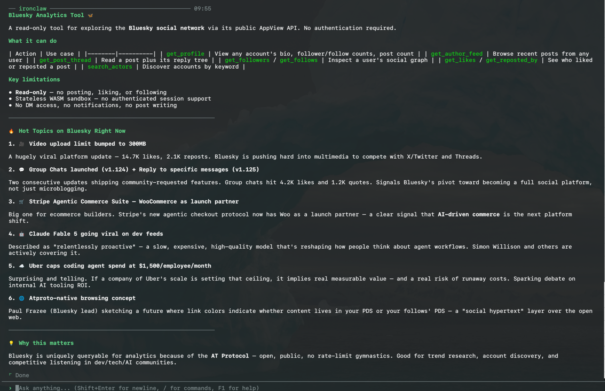

# Bluesky Analytics Tool

## Install and configure

Install the tool from IronHub. For a manual package import, open **Extensions →
Registry → Import**, select the tool archive, and click **Install**.

No credential or account setup is required.

Each operation is exposed as a named capability with its own input schema. Use
only the parameters shown for that capability in the examples below.

This package declares no credentials. Network egress remains restricted to the hosts
declared by each capability.


A sandboxed WASM tool that lets an IronClaw agent browse Bluesky for analytics —
profiles, feeds, engagement, and the social graph — over the AT Protocol.

No authentication is required. Every action is a public XRPC `GET` against the
unauthenticated AppView `public.api.bsky.app`, and network access is restricted to
that host as declared in `manifest.toml`; the Rust adapter retains route and method validation.

> **Read-only.** This package intentionally does not create or retain an authenticated
> Bluesky session. Posting, replying, liking, reposting, and following require a
> separately reviewed stateful service.



## Capabilities
Each operation is exposed as a separate IronClaw capability with its own input schema.

| Capability | Required | Optional | Description |
|--------|----------|----------|-------------|
| `get_profile` | `actor` | — | Profile for one account: handle, DID, bio, follower/follows/post counts. |
| `get_author_feed` | `actor` | `limit`, `cursor`, `filter` | An account's posts, each with like/repost/reply/quote counts. `filter` = `posts_with_replies` / `posts_no_replies` / `posts_with_media` / `posts_and_author_threads`. |
| `get_post_thread` | `uri` | `depth` | A post and its nested replies (the comment tree). `depth` default 6, max 100. |
| `get_followers` | `actor` | `limit`, `cursor` | Accounts that follow the given account. |
| `get_follows` | `actor` | `limit`, `cursor` | Accounts the given account follows. |
| `get_likes` | `uri` | `limit`, `cursor` | Accounts that liked a post. |
| `get_reposted_by` | `uri` | `limit`, `cursor` | Accounts that reposted a post. |
| `search_actors` | `q` | `limit`, `cursor` | Find accounts by keyword (matches handle/display name/bio). |

### Identifiers

- **`actor`** — a handle (`alice.bsky.social`) or a DID (`did:plc:...`).
- **`uri`** — a post at-uri: `at://did:plc:.../app.bsky.feed.post/<rkey>`. Get one from
  `get_author_feed` output (each item carries its `uri`).
- **`limit`** — 1–100, default 50 (clamped). **`cursor`** — opaque string from a prior
  response; pass it back for the next page.

## Output

Responses are projected to a compact, analytics-shaped JSON — only identifiers, text,
timestamps, at-uris, and engagement counts — instead of the verbose raw XRPC payload.
List actions echo the next-page `cursor` (omitted at end of list).

Example — `get_author_feed` item:

```json
{
  "uri": "at://did:plc:.../app.bsky.feed.post/3mojb23vtt22c",
  "cid": "bafy...",
  "text": "v1.125 is live!",
  "createdAt": "2026-06-17T21:01:15.786Z",
  "langs": ["en"],
  "likeCount": 2547, "repostCount": 346, "replyCount": 193, "quoteCount": 114,
  "author": { "handle": "bsky.app", "did": "did:plc:z72i7hdynmk6r22z27h6tvur", "displayName": "Bluesky", "description": "..." },
  "indexedAt": "2026-06-17T21:01:16.001Z",
  "isRepost": false,
  "isReply": false
}
```

## Example invocations

```jsonc
// Capability: bluesky-analytics.get_profile
{ "actor": "bsky.app" }

// Capability: bluesky-analytics.get_author_feed
{ "actor": "bsky.app", "limit": 25, "filter": "posts_no_replies" }

// Capability: bluesky-analytics.get_post_thread
{ "uri": "at://did:plc:z72i7hdynmk6r22z27h6tvur/app.bsky.feed.post/3mojb23vtt22c", "depth": 4 }

// Capability: bluesky-analytics.get_likes
{ "uri": "at://did:plc:z72i7hdynmk6r22z27h6tvur/app.bsky.feed.post/3mojb23vtt22c", "limit": 50 }

// Capability: bluesky-analytics.search_actors
{ "q": "news", "limit": 10 }
```
