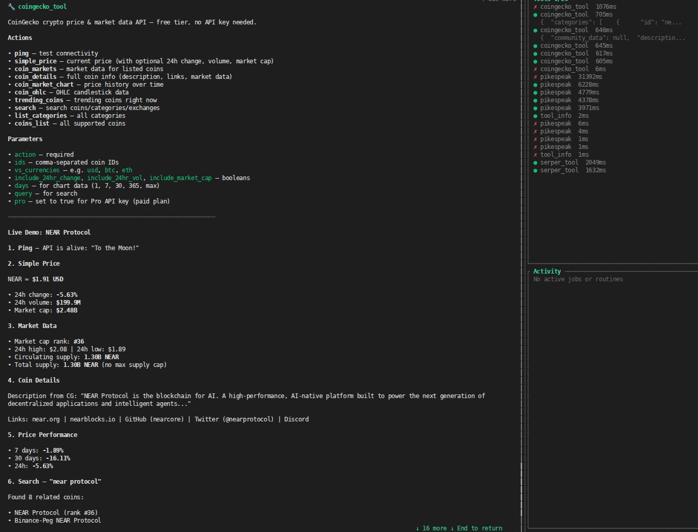

# CoinGecko Tool

## Install and configure

Install the tool from IronHub. For a manual package import, open **Extensions →
Registry → Import**, select the tool archive, and click **Install**.

Open **Configure** and store a CoinGecko Demo or Pro API key. The same account is
host-injected into the correct Demo/Pro header; pass `pro: true` only when the
configured key has Pro access.

Each operation is exposed as a named capability with its own input schema. Use
only the parameters shown for that capability in the examples below.

Credentials are stored by IronClaw and injected only at the declared HTTP boundary; they
are not included in model input or exposed to the WASM component.


A sandboxed WASM tool that gives an IronClaw agent access to the [CoinGecko API](https://docs.coingecko.com) for real-time cryptocurrency prices, market statistics, coin details, and historical data.

The host injects the API key at the HTTP boundary — the WASM code never sees the raw secret — and network access is restricted to `api.coingecko.com` and `pro-api.coingecko.com` as declared in `manifest.toml`; the Rust adapter retains route and method validation.



## Capabilities
| Capability | Required | Optional | Description |
|--------|----------|----------|-------------|
| `ping` | — | `pro` | Verify connection to the CoinGecko API server. |
| `simple_price` | `ids`, `vs_currencies` | `include_market_cap`, `include_24hr_vol`, `include_24hr_change`, `include_last_updated_at`, `pro` | Get current prices of specified coins. |
| `coin_markets` | `vs_currency` | `ids`, `category`, `order`, `per_page`, `page`, `sparkline`, `price_change_percentage`, `pro` | Get detailed market data (price, volume, high/low, etc.). |
| `coin_details` | `id` | `localization`, `tickers`, `market_data`, `community_data`, `developer_data`, `sparkline`, `pro` | Fetch pruned coin metadata (description, links, supply stats). |
| `coin_market_chart` | `id`, `vs_currency`, `days` | `interval`, `pro` | Get historical chart data (prices, caps, volumes) downsampled. |
| `coin_ohlc` | `id`, `vs_currency`, `days` | `pro` | Fetch candlestick OHLC data downsampled. |
| `trending_coins` | — | `pro` | Get trending coins, NFTs, and categories in the last 24h. |
| `list_categories` | — | `order`, `pro` | List all coin categories with market capitalization and volume. |
| `search` | `query` | `pro` | Search for coins, exchanges, categories, and NFTs by keyword. |
| `coins_list` | — | `limit`, `pro` | List supported coins. Queries the markets endpoint for top listings or falls back to a static top 100 list. |

### Key Parameters

*   **`pro`** (`boolean`): Set to `true` if you configured a CoinGecko Pro key. Targets `pro-api.coingecko.com`. Default is `false`.
*   **`days`** (`string`): Historical range. For charts: number of days or `"max"`. For OHLC: `"1"`, `"7"`, `"14"`, `"30"`, `"90"`, `"180"`, `"365"`, or `"max"`.
*   **`limit`** (`integer`): For `coins_list`, limits the dynamic markets query (1–1000). If omitted, returns the top 100 coins instantly using the static fallback list.

## Response Compaction

To operate safely under the **10 MB WASM linear memory limit** and prevent agent prompt token bloat, the tool performs the following optimizations:
- **Pruning**: `coin_details` discards bloated localization and exchange ticker data, returning compact English descriptions, links, market snapshots, and community/developer activity metrics.
- **Downsampling**: `coin_market_chart` and `coin_ohlc` automatically downsample historical series arrays to a maximum of **100 data points**.
- **OOM Mitigation**: The `coins_list` action avoids loading the massive 15,000+ full list in memory. It fetches paginated active listings or falls back to a static array of the top 100 coins.

## Examples

```jsonc
// Ping the API
// Capability: coingecko.ping
{}

// Get prices of BTC and ETH in USD and EUR
// Capability: coingecko.simple_price
{
  "ids": "bitcoin,ethereum",
  "vs_currencies": "usd,eur",
  "include_24hr_change": true
}

// Get top 10 coins by market cap
// Capability: coingecko.coin_markets
{
  "vs_currency": "usd",
  "per_page": 10
}

// Fetch detailed metadata for Solana
// Capability: coingecko.coin_details
{
  "id": "solana"
}

// Get historical chart for NEAR over last 30 days using a Pro key
// Capability: coingecko.coin_market_chart
{
  "id": "near",
  "vs_currency": "usd",
  "days": "30",
  "pro": true
}

// Search for assets matching "gala"
// Capability: coingecko.search
{
  "query": "gala"
}

// Get the top 100 coin IDs list instantly
// Capability: coingecko.coins_list
{
}
```
