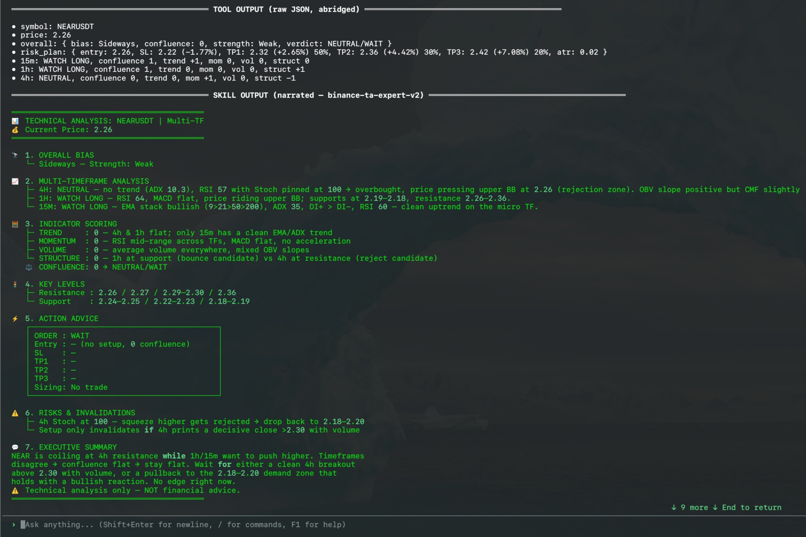

# TA Engine — Deterministic Technical Analysis for Ironclaw

## Install and configure

Install the tool from IronHub. For a manual package import, open **Extensions →
Registry → Import**, select the tool archive, and click **Install**.

No credential is required; only public Binance Spot market data is read.

Each operation is exposed as a named capability with its own input schema. Use
only the parameters shown for that capability in the examples below.

This package declares no credentials. Network egress remains restricted to the hosts
declared by each capability.


Pairs with the **binance-ta-expert-v2** skill. The skill decides *what* to analyze and
*narrates* the result; this tool does the *math*.



## Why

LLMs are unreliable at multi-step arithmetic. An earlier in-context workflow asked the model to compute
EMA/RSI/MACD/ADX/ATR from hundreds of raw candles in-context — slow, token-heavy, and often
numerically wrong. TA Engine moves every calculation into sandboxed Rust and returns a compact,
scored JSON verdict. **Raw candles are fetched and processed inside the tool; they never enter
the LLM context.**

## Capabilities
### `analyze` — multi-timeframe confluence

```jsonc
// Capability: crypto-ta-engine.analyze
{ "symbol": "BTCUSDT", "intervals": ["4h","1h","15m"], "limit": 300 }
```

`intervals` defaults to `["4h","1h","15m"]`, `limit` to `300`. Returns per-timeframe indicator
snapshots + component scores (trend/momentum/volume/structure), a weighted overall verdict
(macro timeframes weighted higher), key support/resistance levels, and an ATR-based risk plan.

### `indicators` — single timeframe

```jsonc
// Capability: crypto-ta-engine.indicators
{ "symbol": "ETHUSDT", "interval": "1h", "limit": 300 }
```

Returns one `TimeframeReport` (indicator values + score) without cross-timeframe aggregation.

## Indicators computed

EMA(9/21/50/200), SMA, RSI(14, Wilder), MACD(12/26/9), Stochastic RSI(14/14/3/3),
ADX(14) + DI±, ATR(14, Wilder), Bollinger(20,2), OBV, CMF(20), VWAP, swing-pivot S/R.

## Scoring

Each component scores −1/0/+1 per the rubric (see skill §6). Confluence = sum, mapped to a
labelled verdict (STRONG BUY … STRONG SELL). Overall = timeframe-weighted (4H=3, 1H=2, 15M=1).

## Security

Binance Spot market-data endpoints are **public** — this tool sends **no credentials** and
declares **no secrets**. The host allowlist restricts it to `api.binance.com` and
`api.binance.us` under `/api/v3`, GET only. Read-only: no orders, accounts, or futures.
