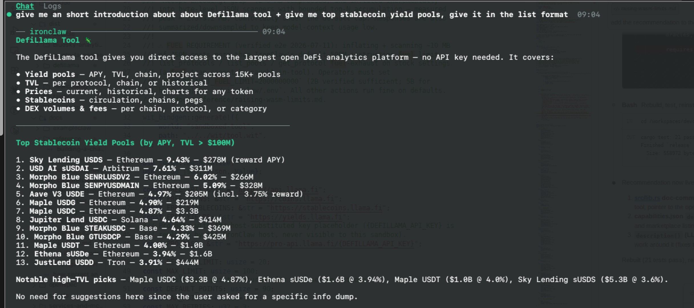

# DefiLlama Tool

## Install and configure

Install the tool from IronHub. For a manual package import, open **Extensions →
Registry → Import**, select the tool archive, and click **Install**.

No credential or paid DefiLlama account is required.

Each operation is exposed as a named capability with its own input schema. Use
only the parameters shown for that capability in the examples below.

This package declares no credentials. Network egress remains restricted to the hosts
declared by each capability.


A sandboxed WASM tool that gives an IronClaw agent access to
[DefiLlama](https://defillama.com) — TVL, prices, stablecoins, yields, volumes,
and fees — via the **free open API**. No API key, no credentials, no setup.



> **Free API only.** DefiLlama Pro places its API key in the URL path. This package
> intentionally uses the free API and never accepts credentials as capability input.

## Capabilities
All list/history outputs are summarized, sorted, and downsampled — several
DefiLlama endpoints return multi-MB payloads (7k+ protocols, 15k+ pools, years
of daily points) that would otherwise flood the model context. `limit` defaults
to 20 (max 100); `points` (time-series length) defaults to 90 (max 500).

### TVL

| Capability | Required | Optional | Notes |
|---|---|---|---|
| `list_protocols` | — | `query`, `category`, `chain`, `limit` | Sorted by TVL desc. |
| `get_protocol` | `protocol` | `points` | Metadata + current per-chain TVL + downsampled TVL history. |
| `protocol_tvl` | `protocol` | — | Current TVL as one number. |
| `list_chains` | — | `limit` | All chains by TVL. |
| `chain_tvl_history` | — | `chain`, `points` | Omit `chain` for the all-chains total. |

### Token prices

`coins` is a comma-separated list of `{chain}:{address}` or `coingecko:{id}`,
e.g. `coingecko:ethereum,bsc:0x762539b45a1dcce3d36d080f74d1aed37844b878`.

| Capability | Required | Optional |
|---|---|---|
| `current_prices` | `coins` | `search_width` |
| `historical_prices` | `coins`, `timestamp` | `search_width` |
| `price_chart` | `coins` | `start` or `end`, `span`, `period`, `search_width` |
| `price_percentage` | `coins` | `timestamp`, `look_forward`, `period` |
| `first_prices` | `coins` | — |
| `block` | `chain`, `timestamp` | — |

### Stablecoins

| Capability | Required | Optional |
|---|---|---|
| `list_stablecoins` | — | `query`, `limit` |
| `get_stablecoin` | `stablecoin_id` (numeric id) | — |
| `stablecoin_history` | — | `chain`, `stablecoin_id`, `points` |
| `stablecoin_chains` | — | — |
| `stablecoin_prices` | — | `points` |

### Yields

| Capability | Required | Optional |
|---|---|---|
| `list_pools` | — | `chain`, `project`, `symbol`, `limit` |
| `pool_history` | `pool` (UUID from `list_pools`) | `points` |

### Volumes & fees

| Capability | Required | Optional |
|---|---|---|
| `dex_overview` | — | `chain`, `limit` |
| `dex_summary` | `protocol` | — |
| `options_overview` | — | `chain`, `data_type`, `limit` |
| `options_summary` | `protocol` | `data_type` |
| `open_interest_overview` | — | `limit` |
| `fees_overview` | — | `chain`, `data_type`, `limit` |
| `fees_summary` | `protocol` | `data_type` |

`data_type`: options → `dailyPremiumVolume`/`dailyNotionalVolume`; fees →
`dailyFees`/`dailyRevenue`/`dailyHoldersRevenue`.

## Examples

```jsonc
// Top 10 lending protocols on Ethereum
// Capability: defillama.list_protocols
{ "category": "Lending", "chain": "Ethereum", "limit": 10 }

// ETH price now, and 24h change
// Capability: defillama.current_prices
{ "coins": "coingecko:ethereum" }
// Capability: defillama.price_percentage
{ "coins": "coingecko:ethereum" }

// Best USDC pools on Arbitrum
// Capability: defillama.list_pools
{ "chain": "Arbitrum", "symbol": "USDC", "limit": 10 }

// Which DEX earned the most fees today?
// Capability: defillama.fees_overview
{ "data_type": "dailyRevenue", "limit": 10 }

// Solana TVL over time
// Capability: defillama.chain_tvl_history
{ "chain": "Solana", "points": 60 }
```

## Large-response handling

Several DefiLlama endpoints return multi-megabyte payloads. The tool requests gzip,
inflates the response incrementally, filters rows while scanning, keeps bounded top-N
results, and downsamples time series before returning JSON to the agent. The full
decompressed document is not retained in memory.

`list_pools`, `list_protocols`, and `get_protocol` perform the heaviest scans.
IronClaw Reborn currently gives every WASM execution a fixed 500M fuel budget;
these three capabilities may therefore return a fuel-limit error on large live
datasets. Legacy WASM limit environment variables are not read by the Reborn
production path, so there is currently no operator-side environment workaround.
The host must add a supported configurable or per-capability fuel budget before
these scans can reliably receive more fuel. Response and memory limits remain
independent.

## Endpoints used

- `https://api.llama.fi` — protocols, chains, TVL, volumes, fees (free)
- `https://coins.llama.fi` — token prices, blocks (free)
- `https://stablecoins.llama.fi` — stablecoin circulation (free)
- `https://yields.llama.fi` — yield pools (free)

API reference: <https://api-docs.defillama.com/> (`defillama-api.yaml` in this
folder is the OpenAPI spec snapshot).
