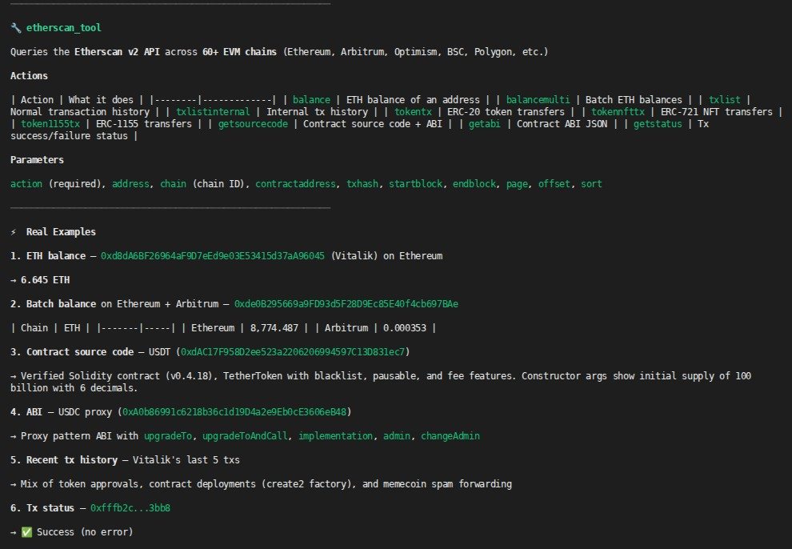

# Etherscan Tool

## Install and configure

Install the tool from IronHub. For a manual package import, open **Extensions →
Registry → Import**, select the tool archive, and click **Install**.

Open **Configure** and store an Etherscan API key. IronClaw injects it as the `apikey`
query parameter only for `api.etherscan.io`.

Each operation is exposed as a named capability with its own input schema. Use
only the parameters shown for that capability in the examples below.

Credentials are stored by IronClaw and injected only at the declared HTTP boundary; they
are not included in model input or exposed to the WASM component.


A sandboxed WASM tool that integrates with the [Etherscan v2 API](https://docs.etherscan.io/v2/) to query account details, histories, and contract schemas across 60+ EVM-compatible chains.

The host injects the API key at the network boundary as the `apikey` query parameter — the WASM code never sees the raw secret — and network access is restricted to `api.etherscan.io/v2/api` as declared in `manifest.toml`; the Rust adapter retains route and method validation.




## Capabilities
| Capability | Required | Optional | Description |
|--------|----------|----------|-------------|
| `balance` | `address`, `chainid` | — | Get native token balance in Wei and formatted Ether. |
| `balancemulti` | `address`, `chainid` | — | Get native balances for a comma-separated list of addresses. |
| `txlist` | `address`, `chainid` | `startblock`, `endblock`, `page`, `offset`, `sort` | List pruned normal transaction history. |
| `txlistinternal` | `chainid` | `address`, `txhash`, `startblock`, `endblock`, `page`, `offset`, `sort` | List pruned internal transactions (specify `address` or `txhash`). |
| `tokentx` | `chainid` | `address`, `contractaddress`, `startblock`, `endblock`, `page`, `offset`, `sort` | List pruned ERC-20 token transfer events (specify `address` or `contractaddress`). |
| `tokennfttx` | `chainid` | `address`, `contractaddress`, `startblock`, `endblock`, `page`, `offset`, `sort` | List pruned ERC-721 token transfer events (specify `address` or `contractaddress`). |
| `token1155tx` | `chainid` | `address`, `contractaddress`, `startblock`, `endblock`, `page`, `offset`, `sort` | List pruned ERC-1155 token transfer events (specify `address` or `contractaddress`). |
| `getabi` | `address`, `chainid` | — | Fetch verified smart contract ABI in JSON format. |
| `getsourcecode` | `address`, `chainid` | — | Fetch verified smart contract source codes and compiler settings. |
| `getstatus` | `txhash`, `chainid` | — | Check contract execution status for a transaction. |
| `gettxreceiptstatus` | `txhash`, `chainid` | — | Check transaction receipt execution status (success/failure). |

### Key Parameters

*   **`chainid`** (`integer`): Numeric EVM chain ID (e.g. `1` for Ethereum Mainnet, `8453` for Base, `137` for Polygon, `42161` for Arbitrum One).
*   **`offset`** (`integer`): Number of transactions per page. Defaults to `20`, clamped to a maximum of `100` to prevent memory exhaustion.
*   **`sort`** (`string`): Sort direction. `"asc"` (default) or `"desc"`.

## Response Compaction & Safeties

To operate safely under the **10 MB WASM linear memory ceiling** and prevent prompt token bloat:
- **Aggressive Pruning**: Transaction lists are stripped of bloated, redundant fields like `nonce`, `blockHash`, `confirmations`, `transactionIndex`, and gas computation details.
- **Size Clamping**: Returned transaction lists are capped at a maximum of **100 entries**. Any additional records returned by Etherscan are truncated.
- **Etherscan Empty-List Handling**: Etherscan API returns a `status: "0"` and messages like `"No transactions found"` for clean/empty addresses. The tool intercepts these envelope states and returns an empty JSON list `[]` to the agent instead of failing with execution errors.

## Examples

```jsonc
// Query native balance for Vitalik's wallet on Ethereum Mainnet
// Capability: etherscan.balance
{
  "address": "0xd8da6bf26964af9d7eed9e03e53415d37aa96045",
  "chainid": 1
}

// Query multi-address balance on Base L2
// Capability: etherscan.balancemulti
{
  "address": "0xd8da6bf26964af9d7eed9e03e53415d37aa96045,0xde0B295669a9FD93d5F28D9Ec85E40f4cb697BAe",
  "chainid": 8453
}

// Get pruned ERC-20 transfers for an address on Polygon
// Capability: etherscan.tokentx
{
  "address": "0xd8da6bf26964af9d7eed9e03e53415d37aa96045",
  "chainid": 137,
  "offset": 10
}

// Get contract ABI on Arbitrum
// Capability: etherscan.getabi
{
  "address": "0xda10009cbd5d07dd0cecc66161fc93d7c9000da2",
  "chainid": 42161
}
```
