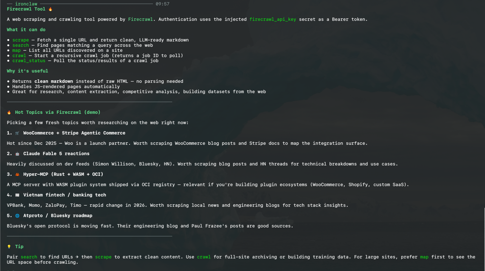

# Firecrawl Tool

A sandboxed WASM tool that gives an IronClaw agent web scraping, search,
site-mapping, and crawling via the [Firecrawl v2 API](https://docs.firecrawl.dev).

The host injects the API key as a Bearer token — the tool code never sees the
raw secret — and network access is restricted to `api.firecrawl.dev` as declared
in `firecrawl-tool.capabilities.json`.



## Actions

| Action | Required | Optional | Description |
|--------|----------|----------|-------------|
| `scrape` | `url` | `formats`, `only_main_content`, `wait_for`, `timeout` | Extract clean markdown/HTML from one page. |
| `search` | `query` | `limit`, `sources` | Find pages by query. `sources` ⊆ `web`/`news`/`images`. |
| `map` | `url` | `search`, `limit`, `include_subdomains` | List every URL on a site, fast. |
| `crawl` | `url` | `limit`, `max_depth` | Start a recursive crawl (async). Returns a `crawl_id`. |
| `crawl_status` | `id` | — | Poll a crawl job for progress and scraped pages. |

Numeric inputs are clamped: search `limit` 1–100 (default 10), scrape `timeout`
1000–300000 ms, `wait_for` ≤ 60000 ms. `crawl_status` echoes at most 25 pages
(with `pages_truncated: true` when there are more).

## Examples

```jsonc
// Scrape one page to markdown
{ "action": "scrape", "url": "https://docs.firecrawl.dev/ai-onboarding" }

// Scrape with options
{ "action": "scrape", "url": "https://example.com", "formats": ["markdown", "html"], "only_main_content": true, "wait_for": 2000 }

// Search the web
{ "action": "search", "query": "best rust web frameworks 2026", "limit": 5, "sources": ["web", "news"] }

// Map a site, ordered by relevance to "blog"
{ "action": "map", "url": "https://example.com", "search": "blog", "limit": 100 }

// Crawl a docs section, then poll
{ "action": "crawl", "url": "https://docs.firecrawl.dev", "limit": 50 }
{ "action": "crawl_status", "id": "<crawl_id from the crawl call>" }
```

## Authentication

```bash
ironclaw tool setup firecrawl-tool   # or `ironclaw tool auth firecrawl-tool`; stores firecrawl_api_key (fc-...)
```

Get a key at <https://www.firecrawl.dev/app/api-keys> (keys start with `fc-`).

The key can also be supplied via the `FIRECRAWL_API_KEY` env var, but only as a
setup convenience: `ironclaw tool auth firecrawl-tool` reads it **once** and
persists it to the encrypted secret store. It is **not** read at runtime — the
running tool never sees the env var, and `FIRECRAWL_API_KEY=... ironclaw run`
has no effect on its own.

## Build

```bash
# from tools-src/firecrawl/
cargo test                                   # native unit tests
cargo build --target wasm32-wasip2 --release # → target/wasm32-wasip2/release/firecrawl_tool.wasm
```

`wasm32-wasip2` emits a WebAssembly **component** directly (no `cargo-component`
required).

## Install

```bash
ironclaw tool install tools-src/firecrawl              # build (needs cargo-component) + install
ironclaw tool install tools-src/firecrawl --skip-build # install the artifact built above
ironclaw tool auth firecrawl-tool                      # store the API key
ironclaw tool list                                     # confirm
```

## API mapping

| Action | Firecrawl endpoint |
|--------|--------------------|
| `scrape` | `POST /v2/scrape` |
| `search` | `POST /v2/search` |
| `map` | `POST /v2/map` |
| `crawl` | `POST /v2/crawl` |
| `crawl_status` | `GET /v2/crawl/{id}` |
