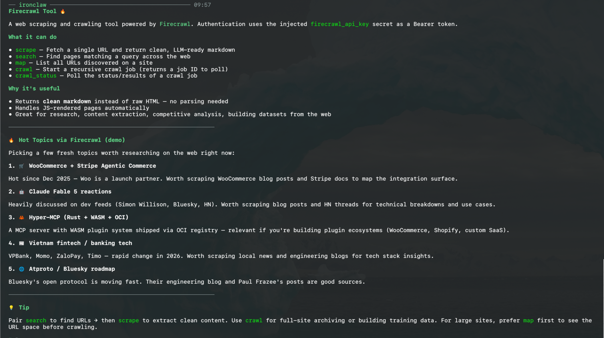

# Firecrawl Tool

## Install and configure

Install the tool from IronHub. For a manual package import, open **Extensions →
Registry → Import**, select the tool archive, and click **Install**.

Open **Configure** and store a Firecrawl API key from https://firecrawl.dev. IronClaw
injects it as a Bearer token only for `api.firecrawl.dev`.

Each operation is exposed as a named capability with its own input schema. Use
only the parameters shown for that capability in the examples below.

Credentials are stored by IronClaw and injected only at the declared HTTP boundary; they
are not included in model input or exposed to the WASM component.


A sandboxed WASM tool that gives an IronClaw agent web scraping, search,
site-mapping, and crawling via the [Firecrawl v2 API](https://docs.firecrawl.dev).

The host injects the API key as a Bearer token — the tool code never sees the
raw secret — and network access is restricted to `api.firecrawl.dev` as declared in `manifest.toml`; the Rust adapter retains route and method validation.



## Capabilities
| Capability | Required | Optional | Description |
|--------|----------|----------|-------------|
| `scrape` | `url` | `formats`, `only_main_content`, `wait_for`, `timeout` | Extract clean markdown/HTML from one page. |
| `search` | `query` | `limit`, `sources` | Find pages by query. `sources` ⊆ `web`/`news`/`images`. |
| `map` | `url` | `search`, `limit`, `include_subdomains` | List every URL on a site, fast. |
| `crawl` | `url` | `limit`, `max_depth` | Start a recursive crawl (async). Returns a `crawl_id`. |
| `crawl_status` | `id` | — | Poll a crawl job for progress and scraped pages. |

Numeric inputs are clamped: search `limit` 1–100 (default 10), scrape `timeout`
1000–300000 ms, `wait_for` ≤ 60000 ms. `crawl_status` echoes at most 25 pages
(with `pages_truncated: true` when there are more).

## Examples

```jsonc
// Scrape one page to markdown
// Capability: firecrawl.scrape
{ "url": "https://docs.firecrawl.dev/ai-onboarding" }

// Scrape with options
// Capability: firecrawl.scrape
{ "url": "https://example.com", "formats": ["markdown", "html"], "only_main_content": true, "wait_for": 2000 }

// Search the web
// Capability: firecrawl.search
{ "query": "best rust web frameworks 2026", "limit": 5, "sources": ["web", "news"] }

// Map a site, ordered by relevance to "blog"
// Capability: firecrawl.map
{ "url": "https://example.com", "search": "blog", "limit": 100 }

// Crawl a docs section, then poll
// Capability: firecrawl.crawl
{ "url": "https://docs.firecrawl.dev", "limit": 50 }
// Capability: firecrawl.crawl_status
{ "id": "<crawl_id from the crawl call>" }
```

## API mapping

| Capability | Firecrawl endpoint |
|--------|--------------------|
| `scrape` | `POST /v2/scrape` |
| `search` | `POST /v2/search` |
| `map` | `POST /v2/map` |
| `crawl` | `POST /v2/crawl` |
| `crawl_status` | `GET /v2/crawl/{id}` |
