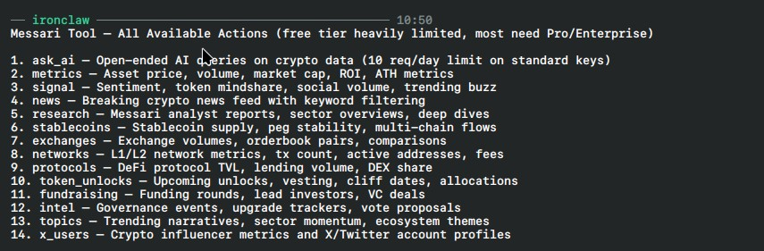

# Frankfurter FX Tool

## Install and configure

Install the tool from IronHub. For a manual package import, open **Extensions →
Registry → Import**, select the tool archive, and click **Install**.

No credential is required; Frankfurter is a public API.

Each operation is exposed as a named capability with its own input schema. Use
only the parameters shown for that capability in the examples below.

This package declares no credentials. Network egress remains restricted to the hosts
declared by each capability.

A sandboxed WASM tool for Ironclaw providing foreign exchange rates, calculations, and analytics using the Frankfurter v2 open-source API (`https://api.frankfurter.dev/v2`).

## Capabilities

- **`convert`**: Quick 1-to-1 currency conversion with rate lookup, mathematical calculation (`amount * rate`), and formatted output (e.g. `$169.00 USD = ₫4,301,134.50 VND`).
- **`batch_convert`**: Convert a base currency amount to multiple target quote currencies in 1 HTTP call.
- **`historical_trend`**: Analyze FX historical trends over date ranges or relative presets (`7d`, `30d`, `90d`, `1y`, `ytd`) with min, max, average, and percentage change.
- **`search_currencies`**: Search active and historical ISO currency codes, names, symbols, and central bank data providers.

## Key Highlights

- **Zero Authentication**: Open API, no secrets or API keys required.
- **Token Optimized**: Returns low-token YAML payloads to the agent.
- **Strict WASI Sandboxing**: Network calls strictly limited to `api.frankfurter.dev`.
