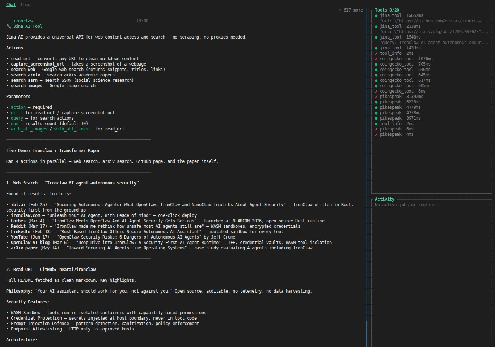

# Jina Reader Tool

A sandboxed WASM tool for IronClaw that wraps the official Jina Reader, Screenshot, and Search APIs. It provides full parity with the core capabilities of the official Jina MCP server, allowing the agent to read webpages, take screenshots, and query general, academic, or image search engines.




## Actions

The tool supports the following actions:

### 1. `read_url`
Fetches a webpage or PDF using Jina Reader (`r.jina.ai`) and converts it into a clean, LLM-friendly Markdown format.

**Parameters:**
* `url` (string, **required**): The target URL to read. Must start with `http://` or `https://`.
* `with_all_links` (boolean, *optional*): If set to `true`, returns all hyperlinks found on the page as structured YAML.
* `with_all_images` (boolean, *optional*): If set to `true`, returns all images found on the page as structured YAML.

### 2. `capture_screenshot_url`
Captures high-quality screenshots of webpages via the Jina Reader API.

**Parameters:**
* `url` (string, **required**): The target URL to capture.
* `first_screen_only` (boolean, *optional*): Set to `true` for a fast single screen capture, or `false` (default) for a full-page capture including content below the fold.

### 3. `search_web`
Performs a live web search using Jina Search (`svip.jina.ai`) and returns the top search results in clean YAML format.

**Parameters:**
* `query` (string, **required**): The search query to run.
* `num` (integer, *optional*): The number of search results to return (default 30).

### 4. `search_arxiv`
Searches academic papers and preprints on the arXiv repository and returns titles, links, citations, and details in YAML.

**Parameters:**
* `query` (string, **required**): The search query to run.
* `num` (integer, *optional*): The number of search results to return (default 30).

### 5. `search_ssrn`
Searches academic papers on SSRN (Social Science Research Network) and returns metadata in YAML.

**Parameters:**
* `query` (string, **required**): The search query to run.
* `num` (integer, *optional*): The number of search results to return (default 30).

### 6. `search_images`
Performs web-based image searches and returns image titles, image URLs, parent webpage URLs, and dimensions.

**Parameters:**
* `query` (string, **required**): The search query to run.
* `num` (integer, *optional*): The number of search results to return (default 30).

---

## Installation

To build and package the tool, run:
```bash
./scripts/build-tool.sh jina
```

To install or overwrite the packaged tool locally under the name `jina-tool`, run:
```bash
ironclaw tool install dist/jina/jina-tool.wasm \
  --capabilities dist/jina/jina-tool.capabilities.json \
  --name jina-tool --force
```

---

## Authentication & Setup

The tool requires a Jina API key for production-level rate limits. You can obtain a free or paid API key at [jina.ai](https://jina.ai/).

1. **Option A (Interactive setup):**
   ```bash
   ironclaw tool setup jina-tool
   ```
   Paste your `jina_...` API key when prompted.

2. **Option B (Environment-based):**
   ```bash
   export JINA_API_KEY="jina_..."
   ironclaw tool auth jina-tool
   ```

At runtime, the host will intercept all request calls to `r.jina.ai`, `s.jina.ai`, and `svip.jina.ai` and inject your API key as a Bearer token. The API key is securely encrypted on disk and never exposed inside the WASM sandbox.

---

## Technical Details

* **Sandbox Target:** `wasm32-wasip2` compiled using Wasmtime.
* **Sandbox Limits:** Employs standard memory limit (10MB) and custom instruction fuel budgets.
* **Serialization:** Emits structured output serialized as **YAML**, minimizing token consumption for downstream LLM parsing.
