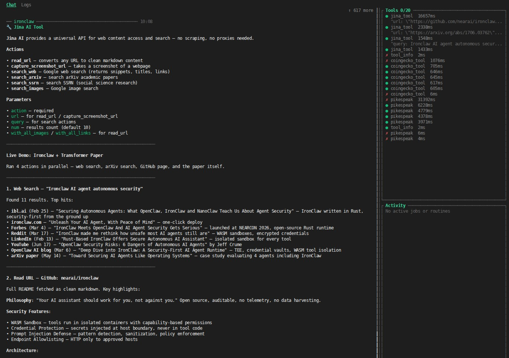

# Jina Reader Tool

## Install and configure

Install the tool from IronHub. For a manual package import, open **Extensions →
Registry → Import**, select the tool archive, and click **Install**.

Open **Configure** and store a Jina API key from https://jina.ai. IronClaw injects the
same credential only for the declared reader/search hosts.

Each operation is exposed as a named capability with its own input schema. Use
only the parameters shown for that capability in the examples below.

Credentials are stored by IronClaw and injected only at the declared HTTP boundary; they
are not included in model input or exposed to the WASM component.

A sandboxed WASM tool for IronClaw that wraps the official Jina Reader, Screenshot, and Search APIs. It provides full parity with the core capabilities of the official Jina MCP server, allowing the agent to read webpages, take screenshots, and query general, academic, or image search engines.

## Capabilities
The tool supports the following actions:

### 1. `read_url`
Fetches a webpage or PDF using Jina Reader (`r.jina.ai`) and converts it into a clean, LLM-friendly Markdown format.

**Parameters:**
* `url` (string, **required**): The target URL to read. Must start with `http://` or `https://`.
* `with_all_links` (boolean, *optional*): If set to `true`, returns all hyperlinks found on the page as structured YAML.
* `with_all_images` (boolean, *optional*): If set to `true`, returns all images found on the page as structured YAML.

### 2. `capture_screenshot_url`
Captures high-quality screenshots of webpages via the Jina Reader API.

**Parameters:**
* `url` (string, **required**): The target URL to capture.
* `first_screen_only` (boolean, *optional*): Set to `true` for a fast single screen capture, or `false` (default) for a full-page capture including content below the fold.

### 3. `search_web`
Performs a live web search using Jina Search (`svip.jina.ai`) and returns the top search results in clean YAML format.

**Parameters:**
* `query` (string, **required**): The search query to run.
* `num` (integer, *optional*): The number of search results to return (default 30).

### 4. `search_arxiv`
Searches academic papers and preprints on the arXiv repository and returns titles, links, citations, and details in YAML.

**Parameters:**
* `query` (string, **required**): The search query to run.
* `num` (integer, *optional*): The number of search results to return (default 30).

### 5. `search_ssrn`
Searches academic papers on SSRN (Social Science Research Network) and returns metadata in YAML.

**Parameters:**
* `query` (string, **required**): The search query to run.
* `num` (integer, *optional*): The number of search results to return (default 30).

### 6. `search_images`
Performs web-based image searches and returns image titles, image URLs, parent webpage URLs, and dimensions.

**Parameters:**
* `query` (string, **required**): The search query to run.
* `num` (integer, *optional*): The number of search results to return (default 30).

---

## Technical Details

* **Sandbox Target:** `wasm32-wasip2` compiled using Wasmtime.
* **Sandbox Limits:** Employs standard memory limit (10MB) and custom instruction fuel budgets.
* **Serialization:** Emits structured output serialized as **YAML**, minimizing token consumption for downstream LLM parsing.
