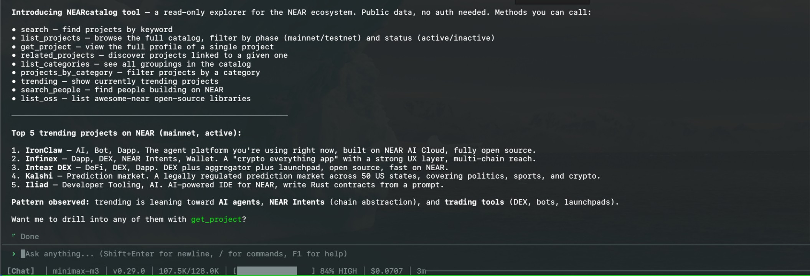

# NEAR Catalog Tool

## Install and configure

Install the tool from IronHub. For a manual package import, open **Extensions →
Registry → Import**, select the tool archive, and click **Install**.

No credential or account setup is required.

Each operation is exposed as a named capability with its own input schema. Use
only the parameters shown for that capability in the examples below.

This package declares no credentials. Network egress remains restricted to the hosts
declared by each capability.


A sandboxed WASM tool that lets an IronClaw agent explore the NEAR ecosystem —
apps/dApps, OSS projects, and the people building on NEAR — using the public
[NEAR Catalog](https://docs.nearcatalog.xyz/) data sources.

No authentication is required. All data comes from public endpoints, and network
access is restricted to the hosts declared in
`manifest.toml`.



## Capabilities
Each operation is exposed as a separate IronClaw capability with its own input schema.

| Capability | Required | Optional | Description |
|--------|----------|----------|-------------|
| `search` | `query` | `limit` | **Server-side** keyword search across project profiles. Best for finding projects by topic. |
| `list_projects` | — | `query`, `status`, `phase`, `limit` | Browse the catalog. `status` (`active`/`inactive`) and `phase` (`mainnet`/`testnet`) filter **server-side**; `query` is a client-side filter over name/tagline/tags. |
| `get_project` | `slug` | — | Full profile (description, tags, links) for one project. |
| `related_projects` | `slug` | `limit` | Projects related to / recommended for a given project slug. |
| `list_categories` | — | — | All catalog categories (`slug` → `label`). |
| `projects_by_category` | `category` | `limit` | Projects within a category slug (e.g. `ai`, `defi`). |
| `trending` | — | `limit` | Currently trending projects in the NEAR ecosystem. |
| `search_people` | — | `query`, `limit` | People building on NEAR. `query` matches name, org, job title, description. |
| `list_oss` | — | `query` | Curated [awesome-near](https://github.com/nearcatalog/awesome-near) OSS frameworks/libraries. `query` keeps matching lines plus section headers. |

`limit` defaults to 25 and is clamped to 1–100.

## Examples

```jsonc
// Keyword-search the catalog (server-side)
// Capability: nearcatalog.search
{ "query": "privacy", "limit": 10 }

// Browse only active mainnet projects
// Capability: nearcatalog.list_projects
{ "status": "active", "phase": "mainnet", "limit": 20 }

// Deep-dive one project, then find related ones
// Capability: nearcatalog.get_project
{ "slug": "ref-finance" }
// Capability: nearcatalog.related_projects
{ "slug": "ref-finance" }

// What's hot right now
// Capability: nearcatalog.trending
{ "limit": 15 }

// Browse categories
// Capability: nearcatalog.list_categories
{}
// Capability: nearcatalog.projects_by_category
{ "category": "defi", "limit": 20 }

// Find people and OSS libraries
// Capability: nearcatalog.search_people
{ "query": "chain abstraction" }
// Capability: nearcatalog.list_oss
{ "query": "wallet" }
```

## Data sources

- `https://api.nearcatalog.xyz/projects?status=&phase=` — catalog, optional server-side filters
- `https://api.nearcatalog.xyz/search?kw=<keyword>` — keyword search
- `https://api.nearcatalog.xyz/project?pid=<slug>` — single project
- `https://api.nearcatalog.xyz/related-projects?pid=<slug>` — related projects
- `https://api.nearcatalog.xyz/categories` — categories
- `https://api.nearcatalog.xyz/projects-by-category?cid=<slug>` — by category or grouping (e.g. `trending`)
- `https://raw.githubusercontent.com/nearcatalog/nearcatalog-people/main/people-on-near.json` — people
- `https://raw.githubusercontent.com/nearcatalog/awesome-near/master/README.md` — OSS libraries
