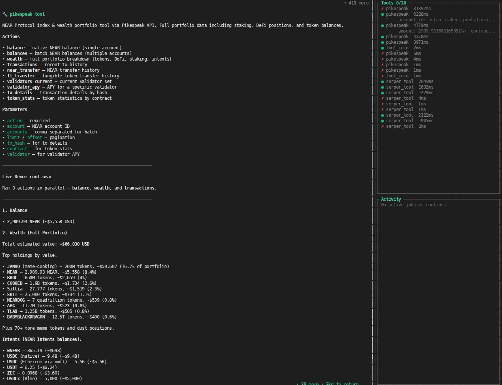

# Pikespeak Tool

## Install and configure

Install the tool from IronHub. For a manual package import, open **Extensions →
Registry → Import**, select the tool archive, and click **Install**.

Open **Configure** and store an API key from https://pikespeak.ai. IronClaw injects it
into `x-api-key` only for the declared Pikespeak API host.

Each operation is exposed as a named capability with its own input schema. Use
only the parameters shown for that capability in the examples below.

Credentials are stored by IronClaw and injected only at the declared HTTP boundary; they
are not included in model input or exposed to the WASM component.

Pikespeak is an on-chain data & analytics solution built on the NEAR Protocol. The solution provides:
- Dashboards and visualisations of the most fundamental Web3 use cases;
- An API with 50+ endpoints to consume live, historical data, and insights in a programmatic way.

This sandboxed WASM tool wraps the Pikespeak API to let an IronClaw agent consume live NEAR data, retrieve portfolio assets, analyze transfers, inspect validators, or run arbitrary GET requests against any API endpoint.

## Capabilities
The tool supports a hybrid layout of dedicated wrapper actions and a universal GET dispatcher `call_api`.

| Capability | Parameters | Description |
|---|---|---|
| `balance` | `account` (string, required) | Query native NEAR and token balance for a single account. |
| `balances` | `accounts` (string, required) | Comma-separated list of NEAR account IDs to query. |
| `wealth` | `account` (string, required) | Fetch portfolio wealth details across RHEA Lend (burrow), Rhea DEX (ref), NEAR Intents (intentsBalances), and Rhea DEX locked liquidity. |
| `transactions` | `account` (required), `offset` (opt), `limit` (opt) | Query recent transactions. |
| `near_transfer` | `account` (required), `offset` (opt), `limit` (opt), `minamount` (opt) | NEAR transfer history. |
| `ft_transfer` | `account` (required), `offset` (opt), `limit` (opt) | Fungible token transfer history. |
| `validators_current` | None | List current active validators. |
| `validator_apy` | `validator` (string, required) | APY of a validator pool. |
| `tx_details` | `tx_hash` (string, required) | Query transaction details by hash. |
| `token_stats` | `contract` (string, required) | Fungible token statistics. |
| `call_api` | `path` (string, required), `query_params` (object, opt) | Universal GET dispatcher to call any valid path with optional query parameters. |
