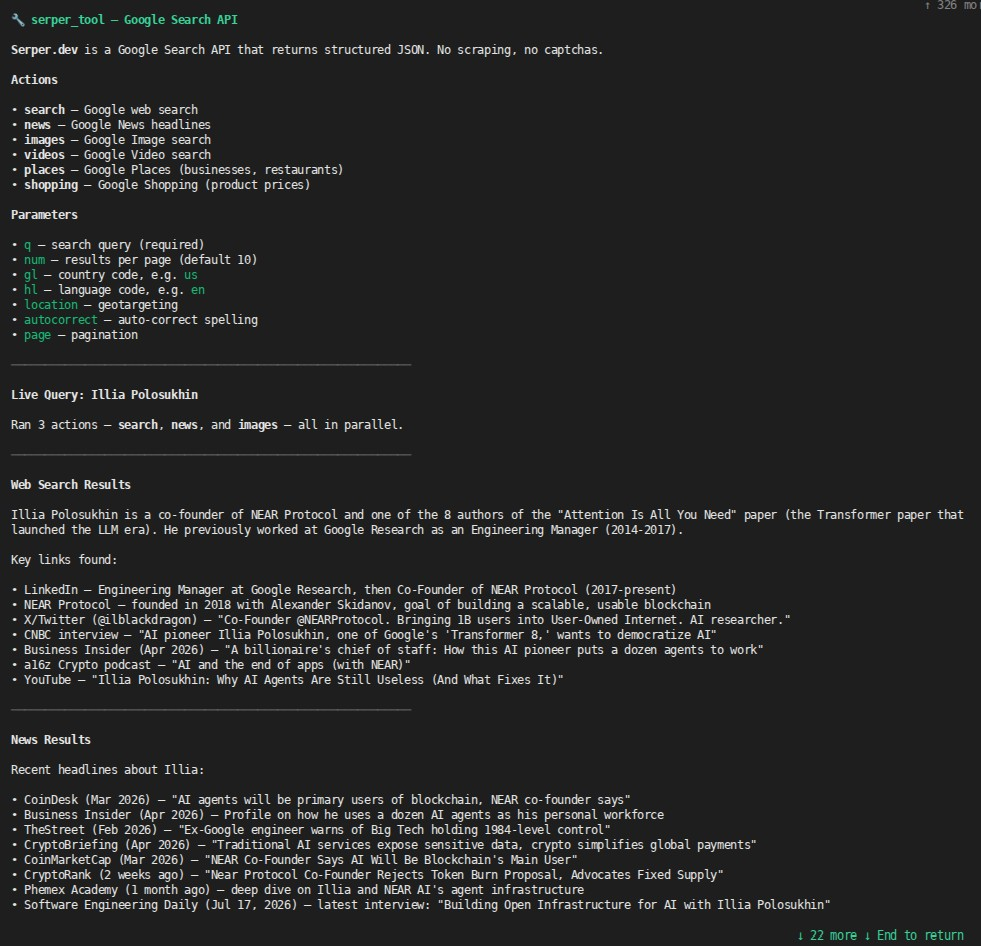

# Serper.dev Search Tool

## Install and configure

Install the tool from IronHub. For a manual package import, open **Extensions →
Registry → Import**, select the tool archive, and click **Install**.

Open **Configure** and store a Serper API key from https://serper.dev. IronClaw injects
it into `X-API-KEY` only for `google.serper.dev`.

Each operation is exposed as a named capability with its own input schema. Use
only the parameters shown for that capability in the examples below.

Credentials are stored by IronClaw and injected only at the declared HTTP boundary; they
are not included in model input or exposed to the WASM component.


A sandboxed WASM tool that gives an IronClaw agent access to the [Serper.dev Google Search API](https://serper.dev/) for real-time web results, news, images, videos, maps/places, and shopping listings.

The host injects the API key at the HTTP boundary — the WASM code never sees the raw secret — and network access is restricted to `google.serper.dev` as declared in `manifest.toml`; the Rust adapter retains route and method validation.



## Capabilities
| Capability | Required | Optional | Description |
|--------|----------|----------|-------------|
| `search` | `q` | `gl`, `hl`, `location`, `num`, `page`, `autocorrect` | Get standard Google search organic results. |
| `news` | `q` | `gl`, `hl`, `location`, `num`, `page` | Get Google News results. |
| `images` | `q` | `gl`, `hl`, `location`, `num`, `page` | Get Google Image search results. |
| `videos` | `q` | `gl`, `hl`, `location`, `num`, `page` | Get YouTube/Google Video search results. |
| `places` | `q` | `gl`, `hl`, `location`, `num` | Query Google Maps local business data. |
| `shopping` | `q` | `gl`, `hl`, `location`, `num`, `page` | Search Google Shopping listings. |

## Examples

```jsonc
// Query Google Web Search
// Capability: serper.search
{
  "q": "Rust WASM tool tutorial",
  "gl": "us",
  "hl": "en"
}

// Get Google News about Generative AI
// Capability: serper.news
{
  "q": "Generative AI",
  "num": 5
}
```
