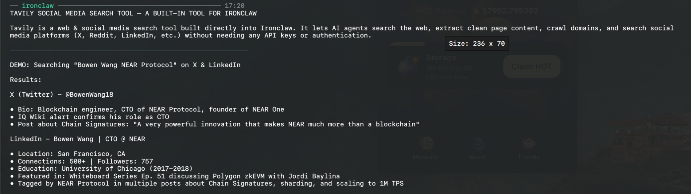

# Tavily Tool

A sandboxed WASM tool that gives an IronClaw agent LLM-optimized web search,
URL content extraction, site crawling, and site mapping via the
[Tavily API](https://docs.tavily.com).



The host injects the API key as a Bearer token — the tool code never sees the
raw secret — and network access is restricted to `api.tavily.com` as declared
in `tavily-tool.capabilities.json`.

## Actions

| Action | Required | Optional | Description |
|--------|----------|----------|-------------|
| `search` | `query` | `search_depth`, `max_results`, `include_answer`, `include_raw_content`, `include_images`, `topic`, `auto_parameters` | Real-time web search returning ranked results with relevance scores. Optionally includes an AI-synthesized answer. |
| `social_media_search` | `query` | `platform`, `max_results`, `include_answer`, `include_raw_content`, `include_images`, `time_range` | Search across platforms (Reddit, Twitter/X, TikTok, Instagram, Facebook, LinkedIn) for trends and real-time public opinion. |
| `extract` | `urls` | `query`, `chunks_per_source`, `extract_depth`, `include_images` | Extract clean markdown content from specific URLs. Provide a `query` to get targeted chunks instead of full pages. |
| `crawl` | `url` | `max_depth`, `limit`, `select_paths`, `exclude_paths` | Recursively ingest content across a site starting from a root URL. Returns raw_content per crawled page. |
| `map` | `url` | `max_depth`, `instructions`, `max_breadth` | Discover and list URLs across a site's link structure without extracting content. |

### Key parameters

**search**:
- `search_depth`: `"basic"` or `"advanced"` (default `"advanced"`)
- `max_results`: Number of results to return (1–20, default 5)
- `include_answer`: Include AI-synthesized answer summary (default false)
- `include_raw_content`: Include full cleaned page content per result (default false)
- `topic`: `"general"`, `"news"`, or `"finance"` (default `"general"`)
- `auto_parameters`: Let Tavily auto-configure parameters based on query intent (default false)

**social_media_search**:
- `platform`: Target specific platforms: `"tiktok"`, `"facebook"`, `"instagram"`, `"reddit"`, `"linkedin"`, `"x"`, or `"combined"` (searches all, default)
- `max_results`: Number of results to return (1–20, default 5)
- `include_answer`: Include AI-synthesized answer summary (default false)
- `include_raw_content`: Fetch and merge deep content extraction from each post (default false)
- `include_images`: Include images from post urls when raw content is fetched (default false)
- `time_range`: Filter posts by time range: `"day"`, `"week"`, `"month"`, or `"year"`

**extract**:
- `urls`: List of URLs to extract (max 10)
- `query`: Query to filter/rerank relevant chunks per source
- `chunks_per_source`: Number of content chunks (≤500 chars each) when `query` is given (default 3)
- `extract_depth`: `"basic"` (default) or `"advanced"` (for JS-heavy pages)

**crawl**:
- `max_depth`: Link depth from the root URL (default 1)
- `limit`: Max pages to crawl (1–50, default 10)
- `select_paths`: Paths to restrict crawl to (e.g. `["/docs/", "/blog/"]`)
- `exclude_paths`: Paths to skip

**map**:
- `max_depth`: Link depth to map (1–5, default 1)
- `instructions`: Natural language guidance for the mapper focus (note: uses 2× credits when set)
- `max_breadth`: Max concurrent paths explored

## Examples

```jsonc
// Search the web with AI answer
{ "action": "search", "query": "latest Rust async runtime benchmarks 2025", "include_answer": true, "max_results": 5 }

// News search
{ "action": "search", "query": "NEAR Protocol ecosystem update", "topic": "news", "max_results": 10 }

// Search social media platforms for trends
{ "action": "social_media_search", "query": "agentic AI framework reviews", "platform": "reddit", "time_range": "month", "max_results": 10 }

// Combined social search with full page content extracted
{ "action": "social_media_search", "query": "Apple Vision Pro user reactions", "platform": "combined", "include_raw_content": true }

// Extract clean markdown from a specific URL
{ "action": "extract", "urls": ["https://docs.tavily.com/documentation/api-reference/introduction"] }

// Extract with query-focused chunks from multiple URLs
{ "action": "extract", "urls": ["https://example.com/page1", "https://example.com/page2"], "query": "authentication flow", "chunks_per_source": 5 }

// Crawl a documentation section
{ "action": "crawl", "url": "https://docs.near.org", "max_depth": 2, "limit": 20, "select_paths": ["/concepts/", "/tools/"] }

// Map a site's URL structure
{ "action": "map", "url": "https://docs.tavily.com", "max_depth": 2 }
```

## Authentication

```bash
ironclaw tool setup tavily-tool   # stores tavily_api_key (tvly-...)
```

Get a key at <https://tavily.com/> (keys start with `tvly-`).

The key can also be supplied via the `TAVILY_API_KEY` env var as a setup
convenience: `ironclaw tool auth tavily-tool` reads it **once** and persists it
to the encrypted secret store. It is **not** read at runtime.

## Build

```bash
# from tools/tavily/
cargo test                                   # native unit tests
cargo build --target wasm32-wasip2 --release # → target/wasm32-wasip2/release/tavily_tool.wasm

# Or use the repo build script (stages dist/ for install):
scripts/build-tool.sh tavily
```

## Install

```bash
ironclaw tool install dist/tavily/tavily-tool.wasm \
  --capabilities dist/tavily/tavily-tool.capabilities.json \
  --name tavily-tool
ironclaw tool auth tavily-tool      # store the API key
ironclaw tool list                  # confirm
```

## API mapping

| Action | Tavily endpoint |
|--------|----------------|
| `search` | `POST /search` |
| `extract` | `POST /extract` |
| `crawl` | `POST /crawl` |
| `map` | `POST /map` |
