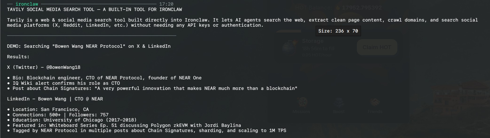

# Tavily Tool

## Install and configure

Install the tool from IronHub. For a manual package import, open **Extensions →
Registry → Import**, select the tool archive, and click **Install**.

Open **Configure** and store a Tavily API key from https://tavily.com. IronClaw injects
it as a Bearer token only for `api.tavily.com`.

Each operation is exposed as a named capability with its own input schema. Use
only the parameters shown for that capability in the examples below.

Credentials are stored by IronClaw and injected only at the declared HTTP boundary; they
are not included in model input or exposed to the WASM component.


A sandboxed WASM tool that gives an IronClaw agent LLM-optimized web search,
URL content extraction, site crawling, and site mapping via the
[Tavily API](https://docs.tavily.com).



The host injects the API key as a Bearer token — the tool code never sees the
raw secret — and network access is restricted to `api.tavily.com` as declared in `manifest.toml`; the Rust adapter retains route and method validation.

## Capabilities
| Capability | Required | Optional | Description |
|--------|----------|----------|-------------|
| `search` | `query` | `search_depth`, `max_results`, `include_answer`, `include_raw_content`, `include_images`, `topic`, `auto_parameters` | Real-time web search returning ranked results with relevance scores. Optionally includes an AI-synthesized answer. |
| `social_media_search` | `query` | `platform`, `max_results`, `include_answer`, `include_raw_content`, `include_images`, `time_range` | Search across platforms (Reddit, Twitter/X, TikTok, Instagram, Facebook, LinkedIn) for trends and real-time public opinion. |
| `extract` | `urls` | `query`, `chunks_per_source`, `extract_depth`, `include_images` | Extract clean markdown content from specific URLs. Provide a `query` to get targeted chunks instead of full pages. |
| `crawl` | `url` | `max_depth`, `limit`, `select_paths`, `exclude_paths` | Recursively ingest content across a site starting from a root URL. Returns raw_content per crawled page. |
| `map` | `url` | `max_depth`, `instructions`, `max_breadth` | Discover and list URLs across a site's link structure without extracting content. |

### Key parameters

**search**:
- `search_depth`: `"basic"` or `"advanced"` (default `"advanced"`)
- `max_results`: Number of results to return (1–20, default 5)
- `include_answer`: Include AI-synthesized answer summary (default false)
- `include_raw_content`: Include full cleaned page content per result (default false)
- `topic`: `"general"`, `"news"`, or `"finance"` (default `"general"`)
- `auto_parameters`: Let Tavily auto-configure parameters based on query intent (default false)

**social_media_search**:
- `platform`: Target specific platforms: `"tiktok"`, `"facebook"`, `"instagram"`, `"reddit"`, `"linkedin"`, `"x"`, or `"combined"` (searches all, default)
- `max_results`: Number of results to return (1–20, default 5)
- `include_answer`: Include AI-synthesized answer summary (default false)
- `include_raw_content`: Fetch and merge deep content extraction from each post (default false)
- `include_images`: Include images from post urls when raw content is fetched (default false)
- `time_range`: Filter posts by time range: `"day"`, `"week"`, `"month"`, or `"year"`

**extract**:
- `urls`: List of URLs to extract (max 10)
- `query`: Query to filter/rerank relevant chunks per source
- `chunks_per_source`: Number of content chunks (≤500 chars each) when `query` is given (default 3)
- `extract_depth`: `"basic"` (default) or `"advanced"` (for JS-heavy pages)

**crawl**:
- `max_depth`: Link depth from the root URL (default 1)
- `limit`: Max pages to crawl (1–50, default 10)
- `select_paths`: Paths to restrict crawl to (e.g. `["/docs/", "/blog/"]`)
- `exclude_paths`: Paths to skip

**map**:
- `max_depth`: Link depth to map (1–5, default 1)
- `instructions`: Natural language guidance for the mapper focus (note: uses 2× credits when set)
- `max_breadth`: Max concurrent paths explored

## Examples

```jsonc
// Search the web with AI answer
// Capability: tavily.search
{ "query": "latest Rust async runtime benchmarks 2025", "include_answer": true, "max_results": 5 }

// News search
// Capability: tavily.search
{ "query": "NEAR Protocol ecosystem update", "topic": "news", "max_results": 10 }

// Search social media platforms for trends
// Capability: tavily.social_media_search
{ "query": "agentic AI framework reviews", "platform": "reddit", "time_range": "month", "max_results": 10 }

// Combined social search with full page content extracted
// Capability: tavily.social_media_search
{ "query": "Apple Vision Pro user reactions", "platform": "combined", "include_raw_content": true }

// Extract clean markdown from a specific URL
// Capability: tavily.extract
{ "urls": ["https://docs.tavily.com/documentation/api-reference/introduction"] }

// Extract with query-focused chunks from multiple URLs
// Capability: tavily.extract
{ "urls": ["https://example.com/page1", "https://example.com/page2"], "query": "authentication flow", "chunks_per_source": 5 }

// Crawl a documentation section
// Capability: tavily.crawl
{ "url": "https://docs.near.org", "max_depth": 2, "limit": 20, "select_paths": ["/concepts/", "/tools/"] }

// Map a site's URL structure
// Capability: tavily.map
{ "url": "https://docs.tavily.com", "max_depth": 2 }
```

## API mapping

| Capability | Tavily endpoint |
|--------|----------------|
| `search` | `POST /search` |
| `extract` | `POST /extract` |
| `crawl` | `POST /crawl` |
| `map` | `POST /map` |
