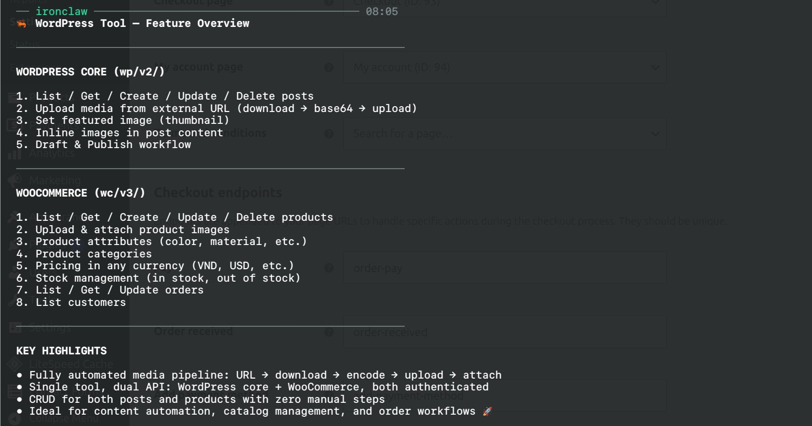

# WordPress + WooCommerce Tool

A sandboxed WASM tool that lets an IronClaw agent operate a **self-hosted**
WordPress site and its WooCommerce store through the REST API:

- **WordPress core** (`/wp-json/wp/v2/…`) — posts, pages, media, comments, users.
- **WooCommerce** (`/wp-json/wc/v3/…`) — products, orders, customers, coupons.
- **`wp_request`** — a raw passthrough to any `/wp-json/*` route for anything the
  typed wrappers don't cover.

The host injects all credentials at the network boundary — the tool code never
sees the raw secrets — and network access is restricted to the single site host
you bake into `wordpress-tool.capabilities.json`.



## Important: this tool targets ONE site, baked in at install

Ironclaw's sandbox pins each tool to a fixed host allowlist that cannot be
changed from inside the sandbox at runtime. So the target site is **baked into
the capabilities file when you install**, and you install one copy per site.

### Configure (recommended): `python3 configure.py`

Run the interactive helper — it fills in the host and username for you (no JSON
editing) and is safe to re-run any time to repoint the tool:

```bash
python3 configure.py                         # prompts for host + username
python3 configure.py --host mystore.com --user admin
python3 configure.py --host mystore.com --api-prefix /api/  # for custom REST paths
python3 configure.py --host '*.apex.com'     # wildcard: all subdomains of one apex
WP_HOST=mystore.com WP_USER=admin python3 configure.py   # non-interactive (CI)
```

It normalises the host (strips any scheme/path, lowercases), validates it is a
bare domain, and writes `allowlist[0].host`, every credential `host_patterns`,
and the Basic-auth `username`. Leave the username blank if you only use
WooCommerce. You can also pass an optional `--api-prefix /custom/` if your site 
doesn't use the standard `/wp-json/` REST prefix. Requires `python3`.

### Configure (manual fallback): edit `wordpress-tool.capabilities.json`

1. Replace **`YOUR_WP_HOST`** with your site host (e.g. `mystore.com`) in **both**
   `capabilities.http.allowlist[0].host` **and** each credential's
   `host_patterns`. A `*.apex.com` wildcard covers subdomains of one apex.
2. Replace **`YOUR_WP_USERNAME`** with your WordPress login (used for the Basic
   Application Password auth) in `wp_app_password.location.username`.

## The site is also supplied per call

Because the sandbox cannot read that baked config, every command also takes a
`site_url` param. Pass your site
host, e.g. `mystore.com`; it must match the host you baked in above. Seed it once
into your agent's instructions: *"Your WordPress site is `mystore.com`."*

## Authentication

Two schemes, injected by the host and fenced by path so they never collide:

| Routes | Auth | Secrets |
|---|---|---|
| `/wp-json/wp/…` (WordPress core) | Application Password → HTTP Basic | `wp_app_password` (username baked in caps) |
| `/wp-json/wc/…` (WooCommerce) | Consumer key/secret → query params | `woo_consumer_key`, `woo_consumer_secret` |

Set the secrets after install (use the same name you installed with — see
[Build & install](#build--install)):

```bash
ironclaw tool setup wordpress-tool
```

- **WordPress Application Password**: Users → Profile → Application Passwords.
  Store the generated password as `wp_app_password` (the login is baked in caps).
- **WooCommerce keys**: WooCommerce → Settings → Advanced → REST API → Add key
  (Read/Write). Store the consumer key as `woo_consumer_key`, the secret as
  `woo_consumer_secret`.

All three secrets are **optional**: set only the WordPress pair, only the
WooCommerce pair, or all. Calls into an unconfigured half return a clear
"missing credential" error and make no request.

> The tool never reads a secret. It issues a credential-free request; the host
> injects the Basic header or the `consumer_key`/`consumer_secret` query params
> for the matching path. Do **not** export keys as env vars and run — secrets go
> through `ironclaw tool setup`.

## Prerequisites

- **HTTPS.** The allowlist is HTTPS-only; Application Passwords require it.
- **Pretty permalinks.** REST must be served under `/wp-json/`. Sites using plain
  permalinks (`?rest_route=/…`) are not supported.

## Commands

`site_url` is required on every command. IDs are integers.

- `wp_request { site_url, method, endpoint, query?, body? }` — raw call; `endpoint`
  must start with `/wp-json/`. Body is sent only on POST/PUT.
- Posts: `list_posts`, `get_post`, `create_post`, `update_post`, `delete_post`.
- Media: `upload_media`, `list_media`, `get_media`, `update_media`, `delete_media`.
- Products: `list_products`, `get_product`, `create_product`, `update_product`,
  `delete_product`.
- Orders: `list_orders`, `get_order`, `update_order`.
- Customers: `list_customers`.

`delete_*` moves to trash by default; pass `force: true` to delete permanently.
(`delete_media` defaults to `force: true` — WordPress cannot trash media.)

**Custom REST prefix.** If your site doesn't serve REST at `/wp-json/` (a changed
`rest_url_prefix`), bake the prefix with `python3 configure.py --api-prefix /api/`
and pass the same `api_prefix` (e.g. `"api_prefix": "/api/"`) on every call. It
defaults to `/wp-json/`.

### Media upload

`upload_media` sends the file as a binary body with the right `Content-Type` and
`Content-Disposition`. The bytes are passed **base64-encoded** in `content_base64`
(a `data:...;base64,` prefix is accepted); the MIME type is guessed from
`filename` unless you pass `mime`. Optional `title`, `alt_text`, `caption`, and
`post` (parent id) ride along as query params. Keep files small (< 10MB) — the
WASM sandbox has a fixed memory limit, so very large media can fail.

### Examples

```jsonc
// Draft a post
{ "command": "create_post", "site_url": "mystore.com",
  "data": { "title": "Hello", "content": "<p>Hi</p>", "status": "draft" } }

// List processing orders
{ "command": "list_orders", "site_url": "mystore.com", "status": "processing", "per_page": 20 }

// Anything else via passthrough
{ "command": "wp_request", "site_url": "mystore.com", "method": "GET",
  "endpoint": "/wp-json/wp/v2/pages", "query": { "per_page": 5 } }

// Upload an image (bytes base64-encoded)
{ "command": "upload_media", "site_url": "mystore.com",
  "filename": "logo.png", "content_base64": "iVBORw0KGgo…",
  "alt_text": "Company logo" }
```

## Build & install

```bash
python3 configure.py --host mystore.com --user admin   # bake your site into the caps file

scripts/build-tool.sh wordpress                        # build + stage into dist/wordpress/

ironclaw tool install dist/wordpress/wordpress-tool.wasm \
  --capabilities dist/wordpress/wordpress-tool.capabilities.json \
  --name wordpress-tool
ironclaw tool setup wordpress-tool
```

> **The install `--name` must match the name you pass to `tool setup`/`tool auth`.**
> Those commands resolve `<name>.capabilities.json` in the tools dir, and install
> stores the files as `<--name>.*`. If you omit `--name`, it defaults to the
> **`.wasm` file stem** — which is why `build-tool.sh` stages the artifacts under
> the crate name (`wordpress-tool.wasm`), so a no-`--name` install also derives
> `wordpress-tool`. Keep one name everywhere.

The staged `.wasm` sits next to the capabilities file so the host can introspect
the tool's `execute`/`schema`/`description` exports. (`cargo build` alone emits
`wordpress_tool.wasm` with an underscore — install from `dist/` or pass
`--name wordpress-tool` explicitly.)
