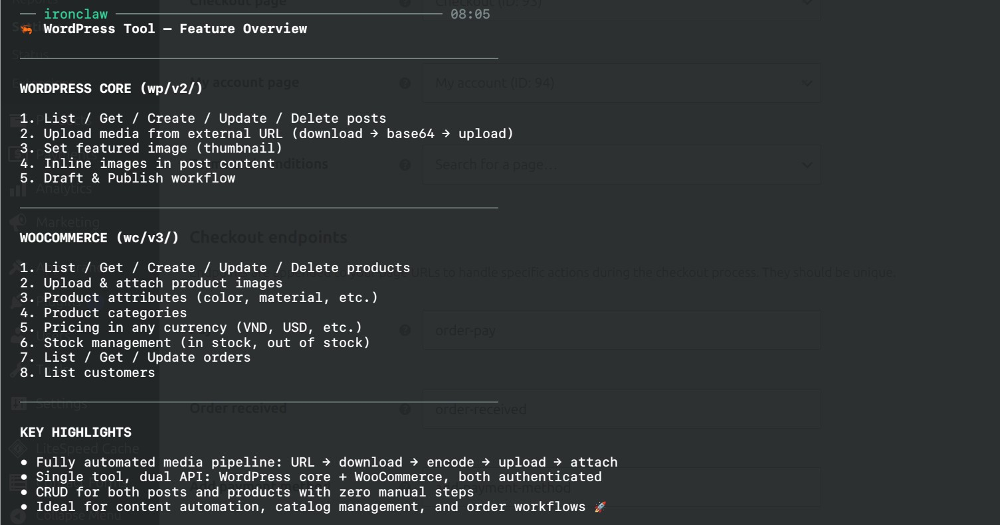

# WordPress + WooCommerce Tool

## Install and configure

Install the tool from IronHub. For a manual package import, open **Extensions →
Registry → Import**, select the tool archive, and click **Install**.

This is a host-pinned template. Replace `wordpress.example.com` in `manifest.toml`,
rebuild the ZIP, then configure the WordPress Basic authorization value and/or
WooCommerce consumer key and secret in IronClaw.

Each operation is exposed as a named capability with its own input schema. Use
only the parameters shown for that capability in the examples below.

Credentials are stored by IronClaw and injected only at the declared HTTP boundary; they
are not included in model input or exposed to the WASM component.


Operate one self-hosted WordPress site and its WooCommerce store through typed,
host-pinned REST capabilities for posts, media, products, orders, and customers.



## Important: one package per site

Before packaging, replace every `wordpress.example.com` in `manifest.toml` with
the exact HTTPS hostname of the target site. A package is intentionally pinned
to one literal host. Every call also takes `site_url`, which must match that
host.

Wildcard domains, arbitrary REST prefixes, and the raw `wp_request`
passthrough are not exposed. This preserves reviewable method, route, credential,
and approval boundaries.

## Credential values

WordPress and WooCommerce use separate product-auth accounts:

| Credential provider | Value to enter | Used by |
|---|---|---|
| `wordpress-basic-authorization` | Base64 of `username:application-password`, without `Basic ` | WordPress posts/media |
| `woocommerce-consumer-key` | WooCommerce key beginning `ck_` | Products/orders/customers |
| `woocommerce-consumer-secret` | WooCommerce secret beginning `cs_` | Products/orders/customers |

Create a WordPress Application Password under **Users → Profile → Application
Passwords**. Create WooCommerce REST credentials under **WooCommerce → Settings
→ Advanced → REST API**. Use a staging site for initial write tests.

## Capabilities

| Area | Capabilities |
|---|---|
| Posts | `wordpress.list_posts`, `get_post`, `create_post`, `update_post`, `delete_post` |
| Media | `wordpress.list_media`, `get_media`, `upload_media`, `update_media`, `delete_media` |
| Products | `wordpress.list_products`, `get_product`, `create_product`, `update_product`, `delete_product` |
| Orders | `wordpress.list_orders`, `get_order`, `update_order` |
| Customers | `wordpress.list_customers` |

Create/update/delete operations require approval. Deletes trash by default
unless their schema explicitly accepts `force: true`.

### Example: list posts

```jsonc
// Capability: wordpress.list_posts
{ "site_url": "mystore.example", "status": "draft", "per_page": 10 }
```

### Example: create a draft

```jsonc
// Capability: wordpress.create_post
{
  "site_url": "mystore.example",
  "data": { "title": "Quarterly update", "content": "...", "status": "draft" }
}
```

### Example: list WooCommerce orders

```jsonc
// Capability: wordpress.list_orders
{ "site_url": "mystore.example", "status": "processing", "per_page": 20 }
```

## Prerequisites

- HTTPS with a publicly reachable REST API.
- Pretty permalinks (`/wp-json/` works).
- Application Password support for WordPress operations.
- WooCommerce REST API enabled for store operations.
