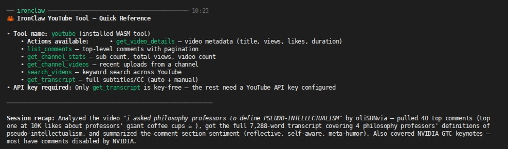

# YouTube Tool

A sandboxed WASM tool for Ironclaw interfacing with YouTube Data API v3 (`https://www.googleapis.com/youtube/v3`) and `youtube-transcript.ai`.



## Features & Supported Actions

| Action | Description | Base Endpoint | Quota / Rate Limit |
|---|---|---|---|
| `get_video_details` | Fetch metadata, duration, views, likes, comment count for video IDs | `/youtube/v3/videos` | 1 unit |
| `list_comments` | Extract comment threads & replies for video or channel sentiment mining | `/youtube/v3/commentThreads` | 1 unit |
| `get_channel_stats` | Retrieve channel stats (subs, total views) & Uploads playlist ID | `/youtube/v3/channels` | 1 unit |
| `get_channel_videos` | Retrieve recent videos from channel Uploads playlist | `/youtube/v3/playlistItems` | 1 unit |
| `search_videos` | Search videos/channels by keyword query | `/youtube/v3/search` | ⚠️ 100 units |
| `get_transcript` | Fetch full plain-text script transcript for a video ID | `youtube-transcript.ai/transcript/<ID>.txt` | Fair use (~2 req/s) |

## Setup & Credentials

Configure your Google API key (with YouTube Data API v3 enabled) via Ironclaw CLI:

```bash
rtk ironclaw tool setup youtube
```

The credential secret is stored under `youtube_api_key` and injected into YouTube Data API HTTP requests as a query parameter (`?key=...`). The `get_transcript` action requires no key.
